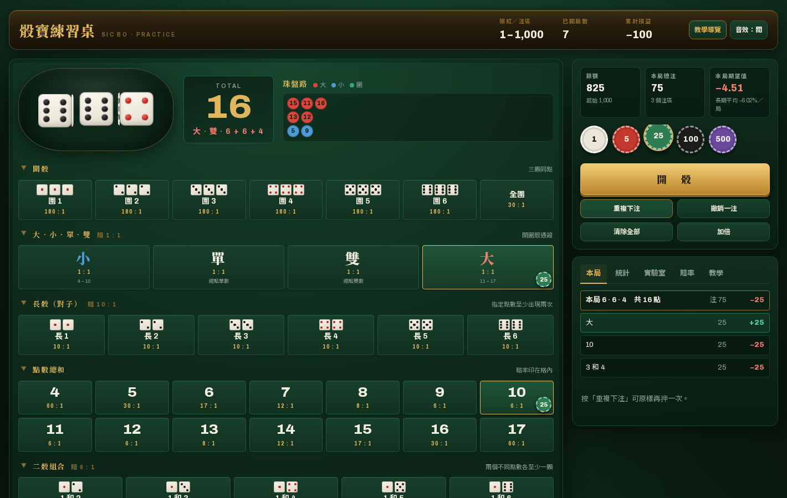
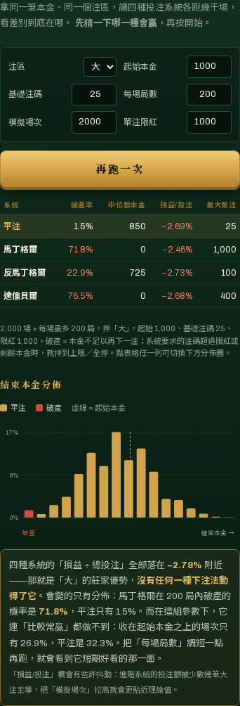
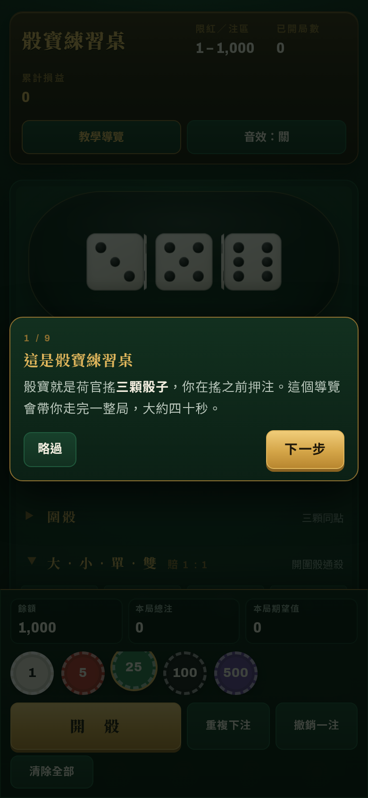
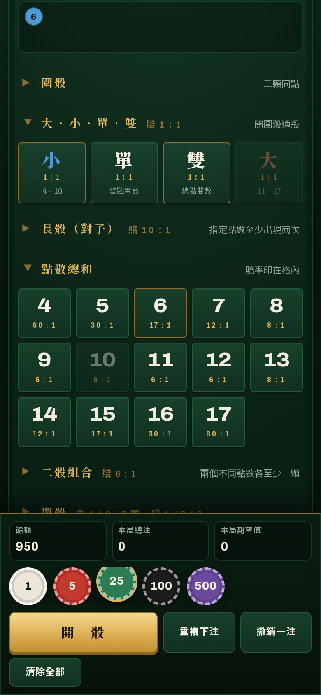

<h1 align="center">骰寶練習桌</h1>

<p align="center">
  用假籌碼練骰寶，在開骰之前就看見每一組注碼的長期期望值。<br>
  <sub>A static, install-to-home-screen Sic Bo practice table that shows you the maths before you bet.</sub>
</p>

<p align="center">
  <a href="https://github.com/chung223/doze/actions/workflows/test.yml">
    
  </a>
  
  
</p>



## 這是什麼

一張完整的骰寶（Sic Bo／大細）檯面，52 個注區、真骰子、珠盤路，全部跑在瀏覽器裡。
沒有真錢、沒有帳號、沒有後端，也沒有任何相依套件——打開 `index.html` 就能玩。

跟一般線上骰寶不同的地方是：**它會一直告訴你這些注長期值多少錢。**
每放一顆籌碼，畫面上就即時算出這組注碼平均每局會賠掉多少；
「實驗室」會把馬丁格爾那類投注系統跑幾千場，讓你親眼看到它改變了什麼、又沒改變什麼。

> 押 100 在「大」，長期平均賠 2.78 元。
> 押 100 在「點數 9」，長期平均賠 18.98 元。
> 同一張桌子、同一個動作，差快七倍——這個網站就是為了讓這件事變得直覺。

## 功能

**檯面**
完整 52 個注區：圍骰、全圍、大小單雙、長骰（對子）、點數 4–17、二骰組合、單骰。
賠率照真實檯面印在格子裡，中獎的注區會發亮，沒押到卻開出的格子描金邊。
骰盅是 CSS 3D 動畫，點數用 `crypto.getRandomValues` 加拒絕採樣產生，六面完全等機率。

**九步互動教學**
第一次開啟自動出現，會實際幫你操作一輪：選籌碼 → 下注 → 指出期望值 → 真的開一局 → 帶你讀結果與珠盤路。
「教學」分頁另有完整玩法、賠率解讀、常見迷思與練習建議。

**即時期望值**
每次下注都算出這組注碼的長期期望損失（籌碼數與百分比）。
統計分頁再給你實際返還率、依你下注加權的理論返還率、各注區成績、
點數分佈（實際 vs 理論），以及返還率的 95% 信賴區間——讓你看清楚「跑三十局說明不了任何事」。

**投注系統實驗室**
平注、馬丁格爾、反馬丁格爾、達倫貝爾，同一筆本金各跑幾千場：

| 系統 | 破產率 | 中位數本金 | 損益 / 投注 | 最大單注 |
|---|---:|---:|---:|---:|
| 平注 | 1.6% | 850 | −2.84% | 25 |
| 馬丁格爾 | **73.5%** | 0 | −3.11% | 1,000 |
| 反馬丁格爾 | 21.3% | 750 | −2.56% | 100 |
| 達倫貝爾 | **76.1%** | 0 | −2.51% | 400 |

<sub>押「大」、本金 1,000、基礎注碼 25、限紅 1,000、每場 200 局、2,000 場。</sub>

<p align="center">
  
</p>

四者的「損益 ÷ 總投注」全部黏在 −2.78%，也就是大小的莊家優勢——**沒有任何一種下注法動得了它**。
變的只有破產率，從 1.6% 到 76%。把每場局數拉到 1,000，連平注都有一半的場次歸零。

**賠率可切換／自訂**
各家賭場賠率不同，尤其全圍、圍骰、長骰、二骰組合這四項。
可以切換內建賠率表，或照你面前那張桌子印的數字自己填；
改一個數字，全站的機率、莊家優勢、檯面印刷與期望值即時重算。
二骰組合從 6:1 改成 5:1，莊家優勢就從 2.78% 跳到 **16.67%**。

**手機優先**
注區分類可收合（手機預設只展開「大小單雙」和「點數」，檯面長度少一半以上），
籌碼與開骰固定在底部工具列，開骰後把結果卡推到眼前，
長按注區退注，下注與開骰有震動回饋，開完骰用中文報「十一點，大」。

**離線可玩**
Service Worker 快取整個 App，加入主畫面後全螢幕開啟，斷網照樣能練。

<p align="center">
  
  &nbsp;&nbsp;
  
</p>

## 快速開始

```bash
git clone https://github.com/chung223/doze.git
cd doze
```

直接用瀏覽器打開 `index.html` 就能玩。

想測 PWA 與 Service Worker（這兩者需要 http/https，不能用 `file://`）：

```bash
npm start                    # http://localhost:8080（用 npx 起 http-server）
python3 -m http.server 8080  # 或者任何靜態伺服器都可以
```

## 部署到 GitHub Pages

站內全部使用相對路徑，放在 `https://<帳號>.github.io/<repo>/` 這種子目錄底下也能正常運作，PWA 同樣可用。

**方法一：直接從分支發佈**
Settings → Pages → Source 選「Deploy from a branch」→ 選分支、資料夾選 `/ (root)` → Save。

**方法二：用內建的 Actions 工作流程**
`.github/workflows/pages.yml` 會在推到 `main` 時自動部署（也可在 Actions 頁面手動觸發）。
第一次要先到 Settings → Pages → Source 選「GitHub Actions」。
部署前會先跑一次測試，賠率算錯就不會上線。

網址會是 `https://chung223.github.io/doze/`。

> 免費帳號的 GitHub Pages 只支援**公開** repo；私有 repo 需要付費方案。

改版之後把 `sw.js` 裡的 `VERSION` 加一，舊快取才會清掉。
（App 檔案本來就是「連線優先」，線上時一定拿到最新版，離線才回退快取。）

## 裝到手機

- **iPhone / iPad（Safari）**：分享按鈕 → 加入主畫面。
- **Android（Chrome）**：選單 → 安裝應用程式，或直接按標題列的「安裝到主畫面」。

## 採用的賠率（標準賠率表）

所有機率由 6³ = 216 種等機率結果算出。

| 注區 | 賠率 | 中獎組合 | 機率 | 莊家優勢 |
|---|---:|---:|---:|---:|
| 大（11–17）／小（4–10） | 1 : 1 | 105 | 48.61% | 2.78% |
| 單／雙 | 1 : 1 | 105 | 48.61% | 2.78% |
| 二骰組合（15 組任一） | 6 : 1 | 30 | 13.89% | 2.78% |
| 單骰（中 1／2／3 顆） | 1／2／3 : 1 | 91 | 42.13% | 7.87% |
| 點數 7 或 14 | 12 : 1 | 15 | 6.94% | 9.72% |
| 點數 8 或 13 | 8 : 1 | 21 | 9.72% | 12.50% |
| 點數 10 或 11 | 6 : 1 | 27 | 12.50% | 12.50% |
| 全圍（任意三同點） | 30 : 1 | 6 | 2.78% | 13.89% |
| 點數 5 或 16 | 30 : 1 | 6 | 2.78% | 13.89% |
| 點數 4 或 17 | 60 : 1 | 3 | 1.39% | 15.28% |
| 圍骰（指定三同點） | 180 : 1 | 1 | 0.46% | 16.20% |
| 點數 6 或 15 | 17 : 1 | 10 | 4.63% | 16.67% |
| 長骰（指定對子） | 10 : 1 | 16 | 7.41% | 18.52% |
| 點數 9 或 12 | 6 : 1 | 25 | 11.57% | 18.98% |

大小單雙遇圍骰（三顆同點）通殺。長骰在開出該點圍骰時也算中獎。

實際下場前一定要看檯面印的賠率——同一個注區賠率差一級，莊家優勢可能差十幾個百分點。
網站的「賠率」分頁可以直接改成你要去的那張桌。

## 專案結構

```
index.html            頁面骨架（注區由 JS 依資料產生）
styles.css            視覺：深綠絨布檯面、黃銅印刷賠率、珠盤路配色
bets.js               機率模型：注區定義、賠率表、亂數（不碰 DOM）
app.js                介面：檯面、下注、結算、統計、實驗室、教學導覽
sw.js                 Service Worker：離線快取
manifest.webmanifest  PWA 設定
icons/                PWA 圖示（192／512／maskable／apple-touch）
test/bets.test.js     窮舉 216 種結果驗證每個注區
.github/workflows/    測試與 Pages 自動部署
```

機率模型獨立成 `bets.js`、完全不碰 DOM，所以測試載入的就是網站實際跑的那份程式碼。

## 測試

三顆骰子只有 216 種等機率結果，所以每個注區的機率與期望值都能**窮舉驗證**，不需要抽樣。

```bash
npm test        # 等同 node --test，零相依套件
```

涵蓋範圍：

- 52 個注區在每一種內建賠率表下，宣告的中獎組合數與期望值都與窮舉結果吻合
- 標準賠率的莊家優勢與公開賠率表一致（大小 2.78%、單骰 7.87%、長骰 18.52%、點數 9／12 18.98% 等）
- 圍骰通殺、長骰在圍骰時中獎、單骰的 1／2／3 倍
- 自訂賠率會即時反映在期望值上
- 開骰亂數與模擬亂數的卡方檢定，以及可重現性
- 四十萬局實測返還率收斂到理論值

每次 push 都會在 GitHub Actions 跑一次，部署到 Pages 之前也會再跑一次。

## 免責聲明

練習用途，非賭博平台，籌碼沒有任何價值，也沒有真錢出入。

骰寶的**每一個注區長期期望值都是負的**。這個桌子是拿來理解賠率的，不是拿來找必勝法的——
如果你玩完之後更不想去賭場，那它就達到目的了。

## 授權

MIT，詳見 [LICENSE](LICENSE)。
